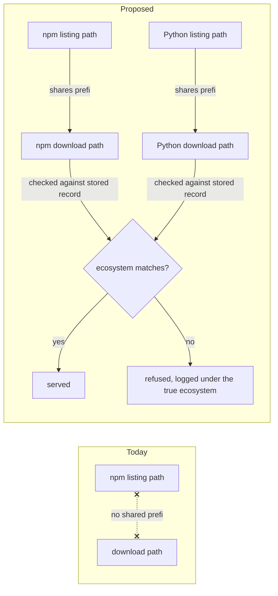

# Gate 3 (reopened): artifact routing under the ecosystem root

**Status: PRE-IMPLEMENTATION.** No code implementing this decision exists yet. Everything below
is either something already observed against the current version of the tools involved, or a
check that is planned but not yet run. The two are kept separate throughout.

## What problem do we have?

People cannot install packages through this firewall today using the current version of npm.
npm 12 — the version npm ships right now — refuses every install, with an error saying remote
fetching is disabled.

The cause: npm 12 added a new safety rule that only trusts a download link if it lives under the
same address path as the package listing that mentioned it. This firewall currently serves its
package listings under one address path and its downloads under a different one. So npm treats
every download this firewall hands out as coming from an untrusted outside source, and refuses
it — even though the download really did come from the same firewall that just answered the
listing request.

This is not an artifact of how it happens to be tested. The two separate address paths are
written into the product's own specification, so every deployment running current npm hits this.
The previous version of npm is unaffected, and the current and previous versions of pip are
unaffected — only npm 12's new rule is the trigger.

**Observed today:**

| Client | Result against the current layout |
| --- | --- |
| npm 12.0.2, safety rule on (its default) | Every install refused |
| npm 12.0.2, safety rule switched off entirely | Installs succeed — confirms the rule is the cause |
| pip 25.0.1, 25.1.1, 26.2.1 | Install successfully, no change needed |

The all-off comparison also rules out a second candidate explanation — a separate warning npm 12
prints about not supporting this test machine's version of Node — as the real cause.

## How will we solve it?

Move downloads to sit underneath each ecosystem's own listing path, so npm's new rule is
satisfied by the address shape itself, without asking anyone to turn any safety rule off.
Downloads for npm packages move under the npm listing path; downloads for Python packages move
under the Python listing path.

One detail is added at the same time: because the address now implies which ecosystem a download
belongs to, the server checks that implied ecosystem against its own stored record for that
download, and refuses the request if they disagree — rather than serving the file and logging it
under the ecosystem the address claimed. This was not part of the first version of this proposal;
it was added after an adversarial review found the gap (see Decisions and findings, and
Limitations).

### Why this shape, not something narrower

- **Turning off npm's safety rule globally was rejected.** It doesn't just affect downloads from
  this firewall — it disables that protection for every download in the whole project. Asking
  operators to switch off a supply-chain protection in order to run a supply-chain firewall
  defeats the product.
- **Three narrower npm settings were checked and rejected.** The closest one only exempts a
  project's *direct* dependencies — everything installed indirectly, which is most of a real
  project's dependency tree, would still be refused.
- **The exact name used in the new shared address segment is our choice, not something npm
  requires.** npm's rule only checks that the download address starts with the listing address;
  it does not care what comes after that. This is recorded as a decision this design made, not a
  constraint it was handed.
- **Both ecosystems move, even though only npm's rule forces the change.** Moving only npm would
  freeze a temporary detail of one tool's current default into a permanent structural difference
  between the two ecosystem halves of this service. It costs the same to move both, and it fixes
  a second, unrelated problem: the operator-facing decision log currently records three different
  "ecosystem" values for only two real ecosystems, which means a download request can't cleanly
  be tied back to the ecosystem whose policy decided it. Moving both halves the same way removes
  that inconsistency rather than adding to it.
- **This does not make npm 12 work everywhere.** Dependencies that a project pulls straight from
  a source repository or an arbitrary link are outside anything this firewall covers, with or
  without this change, and still need npm's rule relaxed for those specific cases. That limit will
  be stated plainly in the operator-facing documentation rather than left implied.

### What this change does not touch

Downloads are identified by a value computed from package facts (name, version, filename, and
similar), not from the web address that requests them. So this change does not move, recompute,
or invalidate any stored record, any verified-content pin, or any first-seen timestamp — it only
changes the address shape and rendering, and adds the one ecosystem-match check described above.

## How will we confirm it is solved?

None of the following has been run yet — all of it is planned confirmation, to be produced by the
slice that implements this change:

| Planned check | Why it's needed |
| --- | --- |
| Install driven by npm 12 with its safety rule left on (default) | This is the failure this change exists to fix; it fails today and must pass after |
| Install driven by pip against the moved Python address | The Python move is for consistency, not necessity, and every existing pip result was gathered before the address moved — old results don't cover the new layout |
| A package or project literally named "artifacts" still resolves correctly | The word "artifacts" now appears in the address itself, so a same-named real package must not collide with it |
| A download belonging to one ecosystem, requested under the other ecosystem's address, is refused and logged under the ecosystem its own record says — not the one the address claims | Closes the gap the adversarial review found (see below) |

**Not yet run, recorded as a limitation:** the route-collision reasoning above (that a package
named "artifacts" can't collide with the new download addresses) has been checked against how the
real router actually matches requests, but has not been exercised as a live install or request
against a running build, because the implementing slice does not exist yet.

## Decisions and findings

- **The workaround of telling operators to disable npm's safety rule entirely was rejected** — it
  removes that protection for every download in a project, not just the ones this firewall
  serves, which undermines the reason to run the firewall at all.
- **Three narrower, more targeted npm settings were each checked and rejected**, the closest one
  covering only a project's direct dependencies and leaving indirect ones — most of a real
  project — still refused.
- **The address segment name added for downloads is our own choice, not something npm dictates** —
  npm's rule only checks the shared prefix, not what follows it. This is documented as a design
  decision, not an externally imposed constraint.
- **Both ecosystems move together, though only npm's current behavior requires it**, so the two
  halves of the service don't permanently diverge over what may be a temporary detail of one
  tool's current default, and so the operator decision log's ecosystem labeling gets fixed at the
  same time rather than left inconsistent.
- **The operator decision log today records three ecosystem values for two real ecosystems.**
  This means a download request currently can't be tied to the ecosystem whose policy decided it
  without extra correlation work. This change fixes that as part of why both halves move.
- **An independent adversarial review found the first version of this proposal undermined its own
  justification:** the new address would imply an ecosystem that nothing actually verified, so a
  download belonging to one ecosystem could be requested and served under the other ecosystem's
  address and get logged under the wrong one. Actual access control (policy) was never at risk —
  it always reads the stored record, never the address — but the traceability of the decision log
  was. The check that closes this gap (comparing the address's implied ecosystem against the
  stored record and refusing on mismatch) was added before this presentation.
- **That same review corrected an earlier claim in the underlying document** about a technical
  detail (router precedence) that the review found is, in fact, already exercised by the running
  code rather than merely assumed — and it's what prompted adding the pip confirmation above.
- **The review checked the address-collision reasoning against the actual router**, not just the
  written route list, including the edge case of a package name containing an encoded slash, and
  found no way for a download address to be mistaken for a package listing address.
- **The product's own specification currently writes the old download address out literally, in
  two places.** This change alters something the specification states outright, so either the
  specification gets amended to match, or the deviation is explicitly recorded and dated. This is
  why the decision needs gate-level sign-off rather than being left as an implementation detail.
- **This does not make npm 12 work universally.** Dependencies pulled straight from a source
  repository or an arbitrary link remain outside this firewall's coverage regardless of this
  change, and operator documentation will state that limit rather than implying otherwise.

## Limitations

- The adversarial review that found and closed the traceability gap above was a single review
  pass, not an independent second review.
- The review could not run npm or pip against a working build, because the code implementing this
  decision does not exist yet — all client-facing confirmation is planned, not observed.
- The review did not check the quoted npm source line numbers against an actual copy of npm 12's
  source code, since no copy is present in this repository; the line references are taken on
  trust from the review's own reading elsewhere.

## Source evidence

- Gate document: `docs/plans/package-firewall-mvp/03-program-design.md`, section "Revision:
  artifact routing under the ecosystem root (reopened 2026-09-19)" (lines 972–1112).

---

Approve Gate 3, or what should change?
