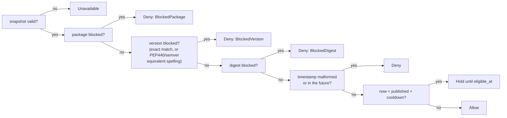

# Slice 2 — Policy Engine, Digests, Blocklist Validation, and Real Readiness

## Delivered

Slice 1 could only answer every package request with `POLICY_UNAVAILABLE`, because there was
no way to load a blocklist. Slice 2 replaces that placeholder with the real SPEC §5 decision
and the real SPEC §8 blocklist validation, unchanged in shape but now doing the actual work.

**The rule-order evaluation** — one function, checked in a fixed order so a decision never
depends on which check happened to run first:

```rust
// src/policy/mod.rs:104-160
pub fn evaluate(
    snapshot: Option<&BlocklistSnapshot>,
    now_utc_micros: i64,
    cooldown_seconds: u64,
    candidate: &Candidate<'_>,
) -> Decision {
    let Some(snapshot) = snapshot else {
        return Decision::Unavailable;
    };
    if !snapshot.is_valid_at(now_utc_micros) {
        return Decision::Unavailable;
    }
    if snapshot.blocks_package(candidate.ecosystem, candidate.name) {
        return Decision::Deny(DenyReason::BlockedPackage);
    }
    if snapshot.blocks_version(candidate.ecosystem, candidate.name, candidate.version) {
        return Decision::Deny(DenyReason::BlockedVersion);
    }
    if candidate
        .advertised_digests
        .iter()
        .chain(candidate.pinned_digests)
        .any(|digest| snapshot.blocks_digest(digest))
    {
        return Decision::Deny(DenyReason::BlockedDigest);
    }
    // ... malformed/future timestamp denies, then cooldown decides Hold vs Allow,
    // with checked/saturating arithmetic so a huge cooldown holds forever instead
    // of wrapping into a past deadline that would read as Allow.
```

**The three-stage configuration check**, so an operator gets a named reason instead of a raw
parser error — and an unknown key can never masquerade as a valid one that got ignored:

```rust
// src/config.rs:100-107
pub fn from_toml_str(text: &str) -> Result<Config, ConfigError> {
    let table: toml::Table = toml::from_str(text).map_err(ConfigError::Syntax)?;
    check_keys(&table)?;                              // stage 2: exact key set
    let raw: RawConfig = toml::from_str(text).map_err(ConfigError::Syntax)?;
    raw.validate()                                     // stage 3: value rules
}
```

`check_keys` (`src/config.rs:203-216`) reports `UnknownKey` before `MissingKey`, because a
typo produces both and the misspelling is the half an operator can actually fix.

**Readiness now answers from a real, loaded blocklist**, not a hardcoded status:

```rust
// src/http/health.rs:23-29
pub async fn ready(State(app): State<Arc<App>>) -> StatusCode {
    let now = app.clock.now_utc_micros();
    match app.blocklist() {
        Some(snapshot) if snapshot.is_valid_at(now) => StatusCode::OK,
        _ => StatusCode::SERVICE_UNAVAILABLE,
    }
}
```

Two new command-line checks — `check-config` and `check-blocklist` — validate a file and exit
non-zero with a named reason on the first problem, writing nothing (`src/main.rs:79-119`).

**Files changed:** `src/policy/mod.rs`, `src/policy/blocklist.rs` (new), `src/policy/digest.rs`
(new), `src/config.rs`, `src/lib.rs`, `src/main.rs`, `src/http/health.rs`,
`blocklist.sample.json`, `config.sample.toml`, `tests/config_validation.rs` (new), plus 30
fixture files under `tests/fixtures/` (not individually rendered). One file outside the slice's
planned list also changed — see Limits.

## Proof

**The slice 1 caveat is closed.** Slice 1's readiness answer could not be falsified, because
nothing in that slice could construct a blocklist to flip it — both the readiness 503 and the
npm 503 traced back to the same `None` state, so only one of slice 1's four tests was an
independent check. Slice 2 removed that placeholder rather than extending it, and then
falsified the readiness answer directly: the implementer deliberately broke the expiry check,
and `readiness_turns_false_at_expiry_while_liveness_stays_true` caught it. Readiness is now a
real, independently-tested property.

**Nine falsification probes**, each breaking one real property of the code and naming the test
that caught it:

| # | Property broken | Test that caught it |
|---|---|---|
| 1–8 | Rule order, digest handling, window checks, config key checks, cooldown arithmetic, PEP 440 / semver equivalence, etc. | Named unit and integration tests in `src/policy/` and `tests/config_validation.rs` |
| 9 | Base64 canonicality guard removed from SRI digest parsing | **No test failed.** The guard was uncovered code. |

Probe 9 is the one to notice. Removing the guard that rejects a non-canonical base64 spelling
left every existing test green — a SHA-256 hash is 32 bytes, and base64-encoding 32 bytes
leaves 2 padding bits that a permissive decoder would silently drop, so a single digest would
then have two valid-looking spellings. The implementer verified an actual colliding pair
independently and closed the gap with an assertion (`src/policy/blocklist.rs:600`,
`sri_base64_and_hex_reach_the_same_digest`) that rejects the non-canonical spelling outright:

```rust
// src/policy/blocklist.rs:598-604
assert!(
    Digest::parse_sri_entry("sha256-LPJNul+wow4m6DsqxbninhsWHlwfp0JecwQzYpOLmCR=").is_err(),
    "a non-canonical spelling — trailing bits a permissive decoder would drop, \
     giving a second base64 string for the very same digest — is rejected, so \
     malformed upstream integrity is reported rather than quietly accepted"
);
```

This is the implementer strengthening its own test suite after a green run, not accepting the
green run at face value — the gap would otherwise have let one digest carry two spellings, and
a blocklist entry written in one spelling could then miss an artifact advertised in the other.

**A self-reported false result.** The probe helper the implementer used to restore patched
files back to their original state used `cp -a`, which preserves file modification times. That
meant `cargo` saw an unchanged mtime, reused a binary it had already built from the *patched*
(broken) source, and reported a test failure that was not real — the broken code was never
actually rebuilt and tested. Rather than re-running until the suite went green, the implementer
traced the failure to its cause and flagged that one piece of its own evidence had weak
provenance. Because of exactly this, the main agent independently re-ran every witness on a
forced rebuild (sources touched to defeat cargo's fingerprint staleness) immediately before this
presentation was written:

- `cargo clippy --all-targets -- -D warnings`: exit 0, no warnings
- `cargo test --lib policy`: `ok.` 15 passed
- `cargo test --test config_validation`: `ok.` 12 passed
- `cargo test --test tracer`: `ok.` 4 passed, no slice 1 regression

**Adversarial testing reproduced no defects**, across all four required angles and beyond them:
inclusive-allow at exactly `t + cooldown`, saturation near `i64::MAX` and `i64::MIN`, zero
cooldown, and a blocklist that is valid but empty — plus rule order, expiry exactness, SRI/hex
digest equivalence, PEP 440 spelling equivalence, 100,000-deep nested JSON run against a
deliberately small 512 KB stack (`deeply_nested_blocklist_is_rejected_not_a_crash`,
`src/policy/blocklist.rs:862-899`), duplicate JSON keys rejected rather than silently resolved,
and 200,000 blocklist entries validated in 81 milliseconds.

**Dependency and test integrity were verified by cryptographic hash.** `Cargo.toml`,
`Cargo.lock` and `tests/tracer.rs` are byte-identical (SHA-256) to the hashes slice 1's code
review recorded — no dependency was added and no existing test was edited to make anything
pass, across both slices.

## Limits

- **Accepted scope exception.** `src/http/npm_routes.rs` was outside slice 2's planned file
  list, but Rust struct literals are exhaustive: adding the Gate 3 digest fields
  (`advertised_digests`, `pinned_digests`) to `Candidate` forced every call site that builds one
  to be updated. The one call site in `npm_routes.rs` now sets both to empty slices plus a
  comment; behaviour is bit-identical. The slice plan's file list should have anticipated this.
- **A stale comment was corrected.** `npm_routes.rs` had claimed slice 2 would deliver the
  SPEC §11 403 rows; that attribution is now corrected to slice 5, code untouched.
- **A version-comparison library's leniency widens blocking only, never loosens it.**
  `nodejs-semver` treats a trailing space in a version string as precedence-equal, so a block on
  `1.0.0` also catches the padded spelling `1.0.0 `. This only ever makes a block more
  conservative — it cannot cause a blocked release to be allowed.
  - Where this stands in `evaluate`'s order — a block still fires before any age check:

- **Rollback logic was written ahead of its slice.** `check_replacement` and `Replacement` in
  `src/policy/blocklist.rs` implement SPEC §8 step 3 (reject a rollback, treat identical
  revision and bytes as a no-op) ahead of the slice 3 poller that will call them. It is already
  unit-tested but unused in production code today.

## Next

Slice 3 is persistence: state survives a restart. It adds the startup exclusive data-directory
lock and recovery, commits the accepted blocklist to the database *before* its snapshot is
published, and gives the poller change detection so a replaced blocklist file is noticed within
two intervals, including a same-second replacement of identical length.

## Recommendation

Ship slice 2 and continue to slice 3. The one open caveat carried from slice 1 is closed and
independently falsified; the only uncovered-code gap the probes found (base64 canonicality) was
closed with a verified assertion, not merely patched; and the one weak-provenance result the
implementer found in its own evidence was traced to its cause and independently re-verified by
the main agent on a forced rebuild rather than accepted on trust.

---

**Context indicator:** presentation setting `auto`, resolved to Markdown (the stored
`## Factory settings` value in `docs/plans/package-firewall-mvp/00-status.md:8-10`).

**Source evidence (compact):**
- `docs/plans/package-firewall-mvp/00-status.md:20-21` — slice 1 and slice 2 proof lines,
  reviews `code-review=SHIP`, `adversarial-testing=NO_DEFECTS_REPRODUCED`
- `docs/plans/package-firewall-mvp/04-slices.md:18` — slice 2's promised outcome row
- `docs/plans/package-firewall-mvp/04-slices.md:19` — slice 3's row (persistence, recovery, poller)
- `docs/plans/package-firewall-mvp/01-product.md:41-46` — product rules on blocklist validity and expiry
- `src/policy/mod.rs:104-160`, `src/policy/blocklist.rs:69-317,598-899`, `src/config.rs:100-216`,
  `src/http/health.rs:23-29`, `src/http/npm_routes.rs:18-58`, `src/main.rs:79-119`, `src/lib.rs:86-118`
- Witness commands re-run by the main agent on a forced rebuild immediately before this
  presentation: `cargo clippy --all-targets -- -D warnings` (exit 0), `cargo test --lib policy`
  (ok, 15 passed), `cargo test --test config_validation` (ok, 12 passed), `cargo test --test
  tracer` (ok, 4 passed)
- `tests/fixtures/` file count verified directly: 30 files

Continue to slice 3, or re-steer?
